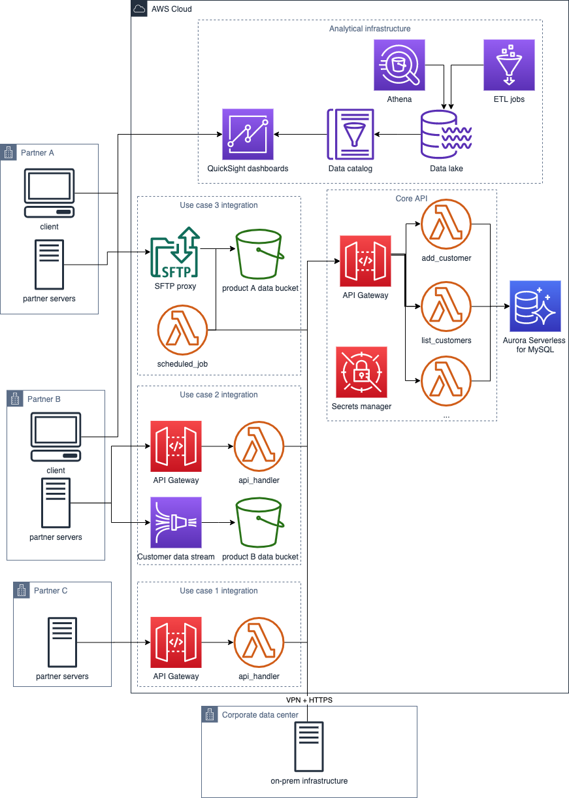

## Introduction

Project provides a sample on how to design a modern insurance IT infrastructure in order to maintain a cost effective and innovative digital platform.

## Overview

The repository consists of two parts:

1. `core-api` - to provide shared functionalitites
2. `api-skeleton` - for product and partner specific integrations

The projects are based on [aws-samples/aws-aurora-serverless-data-api-sam](https://github.com/aws-samples/aws-aurora-serverless-data-api-sam
).

Example model of the infrastructure:

